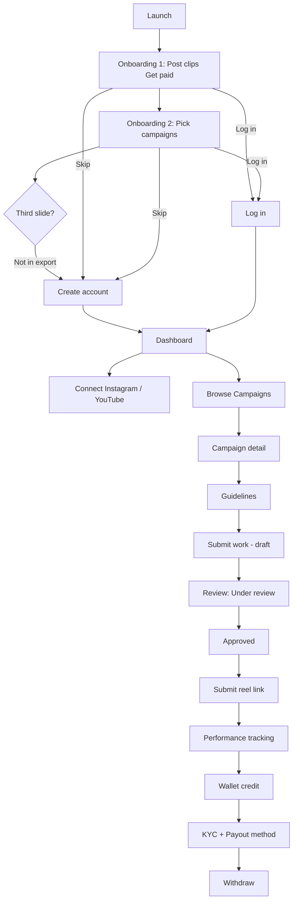

# ViralCut — Figma Product & UX Analysis

**Source:** Figma file `Nd0nOlEojIXnVgkuewjAfJ` (15 iPhone frames)  
**Screenshots:** `e:\Viralcut\figma-screenshots\01-iphone-pro-1.png` … `15-iphone-pro-15.png`  
**Analysis date:** May 30, 2026  
**Platform:** Mobile (iOS-style), portrait, ~402×874 logical (2× export)

> **Platform note (May 2026):** These 15 screens are the **creator mobile app** only. **Brands post campaigns on the web** (`apps/web-brand`). See `docs/TECH_STACK.md` and refined designs in `design/stitch/`.

---

## Table of contents

1. [App overview](#1-app-overview)
2. [Feature overview](#2-feature-overview)
3. [Complete screen-by-screen breakdown](#3-complete-screen-by-screen-breakdown)
4. [User flows & navigation](#4-user-flows--navigation)
5. [Design system & UI patterns](#5-design-system--ui-patterns)
6. [Inferred backend & APIs](#6-inferred-backend--apis)
7. [Observations & assumptions](#7-observations--assumptions)
8. [Questions & unclear areas](#8-questions--unclear-areas)
9. [Suggested improvements](#9-suggested-improvements)

---

## 1. App overview

### What ViralCut is

**ViralCut** is a **regional-first, India-focused creator monetization platform** for people who earn by posting **short-form clips** (Reels, Shorts, memes) — often **without appearing on camera**. The product connects **creators (“clippers”)** with **brand, movie, and community campaigns**, tracks performance (especially views), and pays creators in **Indian Rupees (₹)**.

Tagline repeated across the product: **“Post clips. Get paid.”**

### Core purpose

| Layer | Purpose |
|--------|---------|
| **For creators** | Discover campaigns, follow briefs, post on social platforms, submit proof, track views/earnings, withdraw to bank/UPI |
| **For brands** (implied) | Distribute promotional budgets via performance-based payouts (primarily **₹ per 1K views**, with caps) |
| **For the platform** | Orchestrate campaigns, review submissions, verify social posts, calculate earnings, handle KYC and payouts |

### Target users

- **Primary:** Indian content creators / clippers — Reels, Shorts, meme pages; hostel/lifestyle/regional humor angles appear in copy  
- **Secondary:** Micro-influencers joining **brand campaigns** (boAt, Zepto, CRED, Myntra, etc.)  
- **Persona in designs:** “Pragnatej” (`@pragnatej`) — example logged-in user with **Silver Clipper** tier, ₹35k+ earned  

### Business model (inferred)

- **Performance marketing / CPV:** Pay per 1,000 eligible views (e.g. ₹50/1K for boAt, ₹60/1K for Zepto)  
- **Campaign budgets:** “Pool used / % claimed” suggests finite campaign budgets  
- **Platform fee on withdrawal:** 1.5% on withdraw screen  
- **Gamification:** Clipper tiers (e.g. Silver), “Top 12% this week”  

### Market positioning

- **Currency:** ₹ throughout  
- **Payout rails:** UPI + bank (HDFC example)  
- **Copy:** “Regional-first clipping platform. No camera. No face. Just views and earnings.”  
- **Brands shown:** boAt, Zepto, CRED, Myntra, Noise — India-centric  

---

## 2. Feature overview

| Feature area | What the designs show |
|--------------|------------------------|
| **Onboarding** | Value prop + campaign marketplace preview; Skip; Log in link |
| **Auth** | Sign up (name, phone +91, email, password); Log in (phone/email + password); Forgot password |
| **Dashboard** | Earnings summary, tier badge, connect Instagram/YouTube, trending campaigns carousel |
| **Campaigns** | Live campaign list with CPV, caps, urgency, % claimed, Start earning |
| **Campaign detail** | Brief, earnings model, budget remaining, brand product link |
| **Guidelines** | Do/Avoid rules, 3-step participation, reference video, Submit work CTA |
| **Submit work** | Video vs image; Google Drive link (recommended) or device upload (500MB, 5 min) |
| **Submission lifecycle** | Draft review → approved → submit live reel URL → performance tracking |
| **Submissions hub** | Active vs completed tabs; status badges; views and payout/earned amounts |
| **Performance** | Real-time views, estimated earnings, engagement grid, Instagram deep link |
| **Wallet** | Balance, pending, KYC gate, earnings stats, transaction history |
| **Withdraw** | Amount entry, bank/UPI selection, 1.5% fee, 24h SLA |
| **Profile** | Stats, connected accounts, notifications, KYC, payout methods, earnings history, logout |

---

## 3. Complete screen-by-screen breakdown

---

### Screen 01 — Onboarding: “Post clips. Get paid.”

**File:** `01-iphone-pro-1.png`  
**Figma frame:** iPhone Pro 1  

#### Visible UI

| Zone | Elements |
|------|----------|
| **Status bar** | Time 12:48, signal, Wi‑Fi, battery 47% |
| **Top right** | “Skip” (light gray text button) |
| **Hero** | Purple circle; inner phone mock with **VIRAL CUT** logo + **₹35,170** |
| **Headline** | “Post clips.” (black) + “Get paid.” (purple) |
| **Body** | “Regional-first clipping platform. No camera. No face. Just views and earnings.” |
| **Pagination** | 3 indicators — **1st active** (purple pill), 2 inactive dots |
| **Footer** | “Already have an account? **Log in**” (purple link) |
| **Home indicator** | iOS bar |

#### User actions

- Swipe → next onboarding slide  
- **Skip** → likely sign-up or dashboard (logged out shortcut)  
- **Log in** → Screen 04  

#### Why this screen exists

First-run **value proposition**: monetization without on-camera presence; social proof via earnings figure.

#### Before / after

| Before | After |
|--------|--------|
| App launch / splash (not designed) | Screen 02 (swipe) or Skip → auth / home |

#### Interactions & components

- **Carousel** pagination (3 steps; only 2 content screens appear in export — see [§8](#8-questions--unclear-areas))  
- **Text link** + **Skip** pattern  

#### Inferred backend

- Optional: remote config for onboarding copy and hero earnings number  

#### UX notes

- Skip is low contrast (accessibility)  
- “Regional-first” not defined yet (languages/regions)  
- ₹35,170 may be aspirational vs real balance  

---

### Screen 02 — Onboarding: “Pick any brand campaign”

**File:** `02-iphone-pro-2.png`  

#### Visible UI

| Zone | Elements |
|------|----------|
| **Skip** | Top right |
| **Hero** | Stacked cards: **boAt** ₹50, **Zepto** ₹60, **CRED** ₹45 — each “Live campaign” |
| **Headline** | “Pick any brand campaign” |
| **Body** | “Browse live campaigns from top Indian brands. Choose what fits your audience.” |
| **Pagination** | **Middle dot active** (step 2 of 3) |
| **Footer** | “Already have an account? Log in” |

#### User actions

- Swipe (prev/next), Skip, Log in  

#### Why this screen exists

Shows the **campaign marketplace** before registration — reduces uncertainty about what work looks like.

#### Before / after

| Before | After |
|--------|--------|
| Screen 01 | Screen 03 (carousel) or Create account via CTA not shown — may need “Get started” on slide 3 |

#### Business logic

- Amounts (₹50, ₹60, ₹45) likely **per-1K or per-action placeholders**; differ from CPV rates on later screens (₹50/1K boAt)  

#### UX notes

- No explicit “Next” button — swipe-only may confuse some users  
- Onboarding ₹ amounts vs campaign list CPV need consistent messaging  

---

### Screen 03 — Create account

**File:** `03-iphone-pro-3.png`  

#### Visible UI

| Zone | Elements |
|------|----------|
| **Nav** | Back chevron; title “Create account” |
| **Hero** | “Welcome to **ViralCut**”; “Start earning from your clips today.” |
| **Form** | FULL NAME, PHONE (+91 placeholder), EMAIL, PASSWORD (eye toggle) |
| **Legal** | “By signing up you agree to our **Terms** & **Privacy Policy**” |
| **CTA** | Purple “Create account →” |
| **Footer** | “Already have an account? **Log in**” |

#### User actions

- Fill form, toggle password visibility, open Terms/Privacy, submit, go back, switch to Log in  

#### Why this screen exists

**Account creation** gate before campaigns, wallet, and submissions.

#### Before / after

| Before | After |
|--------|--------|
| Onboarding Skip/Get started, or Log in reverse navigation | OTP verification (phone — **not designed**), then Dashboard or connect-social prompt |

#### Inferred APIs

- `POST /auth/register` — name, phone, email, password  
- Validation: email format, phone length, password policy (not shown)  

#### UX notes

- No Google/Apple sign-in  
- +91 fixed — needs country picker for expansion  
- Password rules not visible until error  

---

### Screen 04 — Log in

**File:** `04-iphone-pro-4.png`  

#### Visible UI

| Zone | Elements |
|------|----------|
| **Nav** | Back; “Welcome back”; “Log **in**” (purple accent) |
| **Sub** | “Continue earning from your clips.” |
| **Fields** | PHONE OR EMAIL, PASSWORD (eye) |
| **Link** | “Forgot password?” (purple, right-aligned) |
| **CTA** | “Log in →” |
| **Footer** | “New to ViralCut? **Sign up**” |

#### User actions

- Login, recover password, sign up, back  

#### Before / after

| Before | After |
|--------|--------|
| Onboarding Log in link, Create account “Log in”, cold start | Dashboard (Screen 05) on success; error states not designed |

#### Inferred APIs

- `POST /auth/login` — identifier + password → session/JWT  

#### UX notes

- No social login  
- Button appears active at empty state (should disable until valid input)  

---

### Screen 05 — Dashboard (Home)

**File:** `05-iphone-pro-5.png`  

#### Visible UI

| Zone | Elements |
|------|----------|
| **Header** | Logo + “ViralCut”; wallet chip **₹35,170** (green); profile avatar |
| **Greeting** | “Hey Pragnatej 👋” |
| **Headline** | “Post clips. Get paid.” |
| **Tier card** | “Silver Clipper” — “Top 12% this week” |
| **Earnings card (dark)** | Total earned ₹35,170; “View analytics >”; Pending ₹5,220 “Will be available soon”; **3 Clips under review >**; **Withdraw** “Transfer to bank” |
| **Connect socials** | IG + YouTube icons; “Connect >” |
| **Trending campaigns** | Horizontal cards: Warrior Reborn ₹8,500 (3d); GlowMax Collab ₹6,200 (5d); Meme Challenge ₹3,000 (2d); “View all” |
| **Bottom nav** | **Dashboard** (active), Campaigns, Submissions, Wallet |

#### User actions

- Open wallet, profile, analytics, pending/review queues, withdraw, connect socials, open campaign, switch tabs  

#### Why this screen exists

**Post-login command center** — money, status, next actions, discovery.

#### Before / after

| Before | After |
|--------|--------|
| Login / registration | Campaign detail, Wallet, Submissions, Connect social flow (not fully designed) |

#### Business logic

- **Pending vs available** balance separation  
- Review gate before funds clear  
- Tier from performance (views/earnings/rank)  
- More campaigns when socials connected  

#### Inferred APIs

- `GET /user/dashboard` — balances, tier, review count, trending campaigns  
- `GET /campaigns?trending=true`  

#### UX notes

- Campaign card amounts (₹8,500) unclear: flat vs cap vs CPV total  
- No withdrawal history on dashboard  
- No “progress to Gold” gamification  

---

### Screen 06 — Campaigns (Live list)

**File:** `06-iphone-pro-6.png`  

#### Visible UI

| Zone | Elements |
|------|----------|
| **Header** | Logo; “Campaigns”; profile |
| **Section** | “Live campaigns” + badge **4 active** |
| **Card: boAt** | Electronics; TRENDING; brief snippet; **₹50 /1K views** up to ₹50,000; **2 days left**; progress **82% claimed**; “Start earning →” |
| **Card: Zepto** | Quick Commerce; URGENT; **₹60 /1K** up to ₹75,000; **1 day left**; **64% claimed**; CTA |
| **Bottom nav** | **Campaigns** active |

#### User actions

- Scroll campaigns, Start earning, profile, other tabs  

#### Before / after

| Before | After |
|--------|--------|
| Dashboard “View all” / Campaigns tab | Campaign detail (07) |

#### Business logic

- Budget pool depletion via “% claimed”  
- Tags: TRENDING, URGENT by rules (time left, fill rate)  

#### Inferred APIs

- `GET /campaigns?status=live`  

#### UX notes

- No search/filter/sort  
- Platform icons (IG/YT) missing on cards  
- “Start earning” vs “join” vs open submit — ambiguity  

---

### Screen 07 — Campaign details (boAt)

**File:** `07-iphone-pro-7.png`  

#### Visible UI

| Zone | Elements |
|------|----------|
| **Top** | Back; **2 days left**; **Trending** badge |
| **Brand** | boAt logo; “Instagram Reels”; **₹50 per 1K views** |
| **Stats bar (black)** | Max payout ₹50,000; Pool used 82%; Category Electronics |
| **Campaign brief** | Airdopes 800 — bass, lifestyle, natural product use |
| **How you earn** | ₹50/1K; up to ₹50,000; budget bar **18% left**; “Filling fast — join before budget runs out” |
| **From the brand** | Product page link (external) |
| **Footer** | Scroll continues — primary CTA likely below fold |

#### User actions

- Back, open product link, scroll to join/submit (not visible)  

#### Before / after

| Before | After |
|--------|--------|
| Campaigns list | Guidelines (08) after “Join” / “Start earning” |

#### Inferred APIs

- `GET /campaigns/{id}` — brief, rates, pool %, deadlines  

#### UX notes

- Join/Apply button off-screen hurts conversion  
- At 100% pool — closed state not designed  
- View verification via IG API implied  

---

### Screen 08 — Campaign guidelines & participation (boAt)

**File:** `08-iphone-pro-8.png`  

#### Visible UI

| Zone | Elements |
|------|----------|
| **Header** | Back; **Creator Reference** thumbnail; “Hostel Unb…”; **0:45** |
| **DO THIS** (green) | New content only; natural product use; high energy; trending audio |
| **AVOID THIS** (red) | No reposts; no price mentions; no competitor comparisons |
| **How to participate** | 1 Create clip → 2 Post on Instagram → 3 Submit link |
| **CTA** | “Submit work for review →” |

#### User actions

- Back, play reference video, read rules, submit  

#### Before / after

| Before | After |
|--------|--------|
| Campaign detail | Submit work (09) or link-only step depending on flow branch |

#### UX notes

- Title truncated (“Hostel Unb…”)  
- No deep link to Instagram  
- Reference area needs clear play affordance  

---

### Screen 09 — Submit your work (boAt Airdopes 800)

**File:** `09-iphone-pro-9.png`  

#### Visible UI

| Zone | Elements |
|------|----------|
| **Header** | Back; “Submit your work”; subtitle campaign name; **Submission tips** (link) |
| **Type** | **Video** selected (Reels/Shorts/Videos) vs Image (memes/posts) |
| **Method A** | Google Drive link — **Recommended**; paste field + Paste; lock note “public link” |
| **OR** | |
| **Method B** | Upload from device — dashed zone; MP4/MOV ≤500MB, max 5 min |
| **Tips card** | Public access; follow brief; don’t delete until review; notification after review |
| **Footer** | Shield “secure and encrypted”; **Submit for review →** |

#### User actions

- Choose media type, Drive vs upload, paste/upload, submit  

#### Before / after

| Before | After |
|--------|--------|
| Guidelines (08) | Confirmation / Submissions list; status UNDER REVIEW |

#### Inferred APIs

- `POST /submissions` — campaignId, type, driveUrl \| multipart file  
- Link validation; virus scan; storage (S3-like)  

#### UX notes

- No upload progress bar for large files  
- Drive private link failure risk  
- Single type per submission unclear  

---

### Screen 10 — Submission details: submit reel link (Zepto)

**File:** `10-iphone-pro-10.png`  

#### Visible UI

| Zone | Elements |
|------|----------|
| **Header** | Back; “Submission Details”; “Zepto - Quick Commerce Campaign”; **Help** |
| **Summary** | Zepto icon; 87K views • Briefed on May 1 |
| **Banner** | Green: “Great news! Your content is approved 🥳” — submit **live Instagram reel** for payout |
| **Proof** | Instagram reel URL field + Paste; public reel note |
| **Tips** | Public reel; product + rules; don’t delete until paid |
| **CTA** | “Submit reel link for payment →” |
| **Footer** | Secure/encrypted |

#### User actions

- Paste URL, submit for payment, help, back  

#### Why this screen exists

**Second-phase submission**: creative approved → creator must publish → platform verifies live post for CPV tracking.

#### Before / after

| Before | After |
|--------|--------|
| Content approved (review queue) | Performance & earnings (11); payout processing |

#### Inferred APIs

- `PATCH /submissions/{id}/proof` — instagramUrl  
- IG Graph API: validate public reel, tags, view counts  

#### UX notes

- Disable CTA until valid URL  
- Post vs Reel vs Story confusion  
- Private account blocker  

---

### Screen 11 — Performance & earnings (Zepto)

**File:** `11-iphone-pro-11.png`  

#### Visible UI

| Zone | Elements |
|------|----------|
| **Header** | Back; “Performance & Earnings”; campaign subtitle; **⋯** menu |
| **Success banner** | Link submitted; reel live; real-time earnings |
| **Content card** | Thumbnail + play; **LIVE**; Submitted May 10 2:30 PM; View on Instagram |
| **Estimated earnings** | **₹2,436.80**; rate badge **₹0.56 / 1K views** ⚠️; real-time copy |
| **Metrics** | Views 4.36K; Estimated earnings; Estimated payout **--** |
| **Performance summary** | Reach 4.08K; Likes 842; Comments 63; Shares 156 |
| **Important notes** | Eligible views; keep public; don’t delete until payout |
| **Disclaimer** | Estimates subject to verification |

#### User actions

- View on Instagram, menu (help/report), info (i) tooltips, back  

#### Before / after

| Before | After |
|--------|--------|
| Reel link submitted (10) | Payout scheduled → Wallet credit → Withdraw |

#### Business logic

- Earnings = f(eligible views, rate per 1K)  
- Reach < Views (consistent)  

#### UX notes — critical

- **Math inconsistency:** ₹0.56/1K × 4.36K views ≈ **₹2.44**, not **₹2,436.80** — likely design typo (**₹560/1K** or **4.36M views**)  
- “Estimated payout --” should show status (Pending verification / Available on date)  

---

### Screen 12 — Submissions hub

**File:** `12-iphone-pro-12.png`  

#### Visible UI

| Zone | Elements |
|------|----------|
| **Header** | Logo; “Submissions”; profile |
| **Tabs** | **Active (3)** | Completed (21) |
| **Summary** | Submitted 12; Approved 9 |
| **Active list** | Zepto UNDER REVIEW ₹75K cap; boAt IN REVIEW ₹50K; Myntra PENDING REVIEW ₹40K — views + dates |
| **Completed** | CRED APPROVED Earned ₹18,450; Noise APPROVED Earned ₹11,500 |
| **Bottom nav** | **Submissions** active |

#### User actions

- Switch tab, open submission detail, navigate app  

#### Before / after

| Before | After |
|--------|--------|
| Submit flows, dashboard “clips under review” | Detail screens (10, 11, 07…) per row |

#### Inferred APIs

- `GET /submissions?status=active|completed`  
- `GET /submissions/summary`  

#### UX notes

- THREE review statuses (Pending / Under / In) — need glossary  
- No search on 21+ completed  
- Empty state not designed  

---

### Screen 13 — Wallet

**File:** `13-iphone-pro-13.png`  

#### Visible UI

| Zone | Elements |
|------|----------|
| **Header** | Logo; “Wallet”; “Manage your earnings”; profile |
| **Balance card** | Available **₹35,170**; +₹5,220 pending; Withdraw to UPI/Bank |
| **KYC banner** | Orange: verify email + payout method to withdraw |
| **Earnings overview** | Total ₹40,390; This month ₹16,720; Clips paid 9 |
| **Transactions** | CRED ₹18,450 Paid; boAt ₹11,500 Paid; View all |
| **Bottom nav** | **Wallet** active |

#### User actions

- Withdraw, complete KYC, view all transactions, profile  

#### Before / after

| Before | After |
|--------|--------|
| Dashboard withdraw, tab bar | Withdraw screen (14); KYC flow (not designed) |

#### UX notes

- Withdraw looks enabled but KYC blocks — should disable or explain inline  
- Pending ₹5,220 breakdown not drillable  

---

### Screen 14 — Withdraw

**File:** `14-iphone-pro-14.png`  

#### Visible UI

| Zone | Elements |
|------|----------|
| **Header** | Back; “Withdraw”; Help |
| **Balance** | ₹35,170; +₹5,220 pending |
| **Amount** | Input ₹0; **Use max**; quick add +1K/+5K/+10K/+20K |
| **Withdraw to** | Bank HDFC •••• 1234 (Ravi Kumar) ✓; UPI ravi@okhdfcbank |
| **Summary** | Amount; Platform fee 1.5%; You will receive |
| **Banner** | Processed within 24 hours |
| **CTA** | “Withdraw Now” (active at ₹0) |

#### User actions

- Enter amount, max, presets, change payout method, withdraw, help  

#### Inferred APIs

- `GET /wallet/balance`, `GET /payout-methods`, `POST /withdrawals`  

#### UX notes

- CTA should disable when amount 0 or > available  
- Min withdrawal limit not shown  
- Add new bank/UPI path unclear  

---

### Screen 15 — Profile

**File:** `15-iphone-pro-15.png`  

#### Visible UI

| Zone | Elements |
|------|----------|
| **Header** | Back; “Profile” |
| **Card** | Avatar PR + edit pencil; Pragnatej; @pragnatej; Joined March 2025 |
| **Stats** | Total earned ₹40,390; Views 6.5L+; Clips 12 |
| **ACCOUNTS** | Connected Accounts (1); Notification Settings |
| **EARNINGS & PAYOUTS** | KYC **Pending**; Payout Methods; Earnings History |
| **CTA** | Log out (red/pink) |

#### User actions

- Edit avatar, manage accounts, notifications, KYC, payouts, history, logout  

#### Entry

Likely header avatar on Dashboard / Wallet / Campaigns (not shown on every screen).

#### UX notes

- KYC pending + high earnings = anxiety; needs “Complete KYC” CTA prominence  
- No Help/Support link  
- Edit scope (name only vs full profile) unclear  

---

## 4. User flows & navigation

### 4.1 Primary navigation (logged in)

```
┌─────────────┬─────────────┬──────────────┬────────┐
│  Dashboard  │  Campaigns  │ Submissions  │ Wallet │
└─────────────┴─────────────┴──────────────┴────────┘
       │              │              │          │
       │              └──────┬───────┘          │
       │                     │                  │
       └─────────────────────┴──────────────────┘
                    (Profile via header avatar — inferred)
```

### 4.2 New user journey



### 4.3 Campaign participation (happy path)

| Step | Screen | Actor / system |
|------|--------|----------------|
| 1 | Campaigns list | User picks live campaign |
| 2 | Campaign detail | Reads brief, pool, rate |
| 3 | Guidelines | Watches reference, accepts rules |
| 4 | Submit work | Uploads video or Drive link |
| 5 | — | Brand/platform reviews creative |
| 6 | Submission details | User posts on IG, pastes reel URL |
| 7 | Performance | System tracks views, estimates ₹ |
| 8 | Submissions / Wallet | Status → paid; withdraw |

### 4.4 Submission state machine (inferred)

```
DRAFT_SUBMITTED → PENDING_REVIEW → IN_REVIEW / UNDER_REVIEW
    → APPROVED (creative) → AWAITING_LIVE_LINK → LIVE_TRACKING
    → PAYOUT_PENDING → PAID
```

Rejections, resubmissions, and appeals are **not designed**.

### 4.5 Screen connection matrix

| From | To | Trigger |
|------|-----|---------|
| Onboarding 1–2 | Create account / Log in | Skip, footer links, implied slide 3 CTA |
| Auth | Dashboard | Successful login/register |
| Dashboard | Campaign detail | Trending card, View all → Campaigns |
| Dashboard | Wallet | Balance chip, Withdraw |
| Campaigns | Campaign detail | Start earning |
| Campaign detail | Guidelines | Scroll CTA (implied) |
| Guidelines | Submit work | Submit work for review |
| Submit work | Submissions | After submit |
| Submissions | Submission details / Performance | Row tap |
| Approved flow | Submit reel URL | Banner CTA |
| Reel submitted | Performance | Auto navigation (implied) |
| Wallet | Withdraw | Withdraw CTA |
| Header | Profile | Avatar (inferred) |

---

## 5. Design system & UI patterns

### Visual language

| Token | Usage |
|-------|--------|
| **Primary purple** | CTAs, links, active nav, brand accents |
| **Green** | Money, success, paid, available balance |
| **Orange** | Urgency, pool used, KYC warning |
| **Red/pink** | Avoid rules, logout |
| **Dark cards** | Earnings hero, campaign stats |
| **Typography** | Bold headlines; gray uppercase field labels |

### Components

- **Bottom tab bar** (4 tabs) with pill active state  
- **Campaign cards** — logo, category, tags, CPV, cap, progress bar, CTA  
- **Status pills** — TRENDING, URGENT, UNDER REVIEW, APPROVED, LIVE  
- **Do / Avoid** dual cards  
- **Numbered stepper** (participation)  
- **Segmented control** — Active vs Completed submissions  
- **Radio + card** selection (submit method)  
- **Form fields** — outlined inputs, password toggle  
- **Banners** — success (green), warning (KYC orange), tips (yellow/purple)  

### Platform

- iOS status bar and home indicator throughout  
- Mobile-first; no tablet/desktop frames  

---

## 6. Inferred backend & APIs

### Authentication & user

| Endpoint (inferred) | Purpose |
|---------------------|---------|
| `POST /auth/register` | Sign up |
| `POST /auth/login` | Login |
| `POST /auth/forgot-password` | Reset |
| `GET /user/me` | Profile, tier, stats |

### Campaigns

| Endpoint | Purpose |
|----------|---------|
| `GET /campaigns?status=live` | List with CPV, caps, % claimed |
| `GET /campaigns/{id}` | Brief, pool, deadlines, links |
| `GET /campaigns/trending` | Dashboard carousel |

### Submissions & review

| Endpoint | Purpose |
|----------|---------|
| `POST /submissions` | Draft upload (file or Drive) |
| `PATCH /submissions/{id}/proof` | Instagram reel URL |
| `GET /submissions` | Active/completed lists |
| `GET /submissions/{id}/performance` | Views, earnings, engagement |

### Social integrations

| Integration | Purpose |
|-------------|---------|
| Instagram OAuth / Graph API | Connect account, verify reels, pull metrics |
| YouTube API | Connect for Shorts campaigns |

### Wallet & payouts

| Endpoint | Purpose |
|----------|---------|
| `GET /wallet` | Available, pending, lifetime |
| `GET /transactions` | History |
| `POST /withdrawals` | Amount, method, fee calculation |
| `GET/POST /kyc` | Verification status |
| `CRUD /payout-methods` | Bank, UPI |

### Business rules engine

- Eligible view counting (anti-fraud)  
- Campaign budget consumption (% claimed)  
- Tier ranking (Silver, top %)  
- Platform fee 1.5% on withdraw  
- 24h withdrawal SLA  

---

## 7. Observations & assumptions

### Product assumptions

1. Creators **already have** or will create Instagram (primarily Reels) content.  
2. **Two-step submission** is intentional: (a) creative approval, (b) live link for measurement.  
3. **India-only** launch (₹, UPI, +91, lakh notation, local brands).  
4. **Faceless / clipping** positioning targets editors aggregating third-party or brand-friendly content.  
5. **Performance pay** dominates; flat campaign cards on dashboard may be separate deal types (movie promo ₹8,500).  

### Consistency observations

| Topic | Observation |
|-------|-------------|
| Onboarding ₹50/60/45 vs CPV | May confuse users vs ₹50/1K on list |
| Earnings on screen 11 | Likely Figma data error on rate display |
| Review statuses | Three similar labels on Submissions |
| Screen 3 in onboarding | Pagination shows 3 dots; only 2 onboarding art screens exported |

### Security & trust

- “Encrypted” copy on submit/withdraw  
- KYC required before withdraw  
- Public link requirements for Drive and IG  

---

## 8. Questions & unclear areas

### Onboarding & auth

1. What is **onboarding screen 3** (third pagination dot)? Get Started? Not in export.  
2. Is **phone OTP** required after Create account? No OTP screen designed.  
3. **Forgot password** flow — email or SMS?  

### Campaigns

4. Does **Start earning** reserve budget or only open read-only detail?  
5. When pool hits **100%**, what does UI show?  
6. Are dashboard amounts (**₹8,500** Warrior Reborn) **flat fees** or **max CPV**?  
7. Which platforms per campaign — always IG Reels or also YouTube Shorts?  

### Submissions

8. Full **rejection** and **resubmit** flow?  
9. Can one campaign have **multiple clips**?  
10. Order of steps: submit **draft before** posting, or post first on some campaigns? Screen 08 says post then link; screen 09 uploads file before live post — **branching unclear**.  
11. **Image/memes** path — same review + link flow?  

### Earnings

12. Definition of **eligible views**?  
13. Fix **₹0.56 vs ₹2,436** — source of truth for rate on Zepto campaign?  
14. When does **pending ₹5,220** become available?  

### Wallet & compliance

15. **KYC** document types and provider?  
16. **Minimum** withdrawal?  
17. Tax / TDS handling?  

### Profile & settings

18. **Connected Accounts** — only IG+YT or more?  
19. **View analytics** on dashboard — separate screen not designed.  
20. **Notifications** types?  

### Missing screens (recommended for next design pass)

- Splash / app icon  
- Onboarding slide 3 + Get Started  
- OTP / email verify  
- Forgot password  
- Connect Instagram / YouTube (OAuth)  
- Submission success / error toasts  
- Rejection + appeal  
- Campaign closed / budget full  
- Full transaction history  
- KYC step-by-step  
- Add bank / UPI  
- Withdraw success / failure  
- Push notification preferences  
- Help / support / FAQ  

---

## 9. Suggested improvements

### High priority

1. **Fix earnings math** on Performance screen (rate vs total vs views).  
2. **Unify payout copy** across onboarding cards and campaign CPV.  
3. **Sticky primary CTAs** on Campaign detail (Join / Start earning visible without scroll).  
4. **Disable** Withdraw / Submit buttons until valid input.  
5. **KYC gate** on Withdraw button when not verified (Wallet + Withdraw).  
6. **Clarify submission order** with one diagram: draft → approve → publish → link → track.  

### Medium priority

7. Add **search/filter** on Campaigns (category, payout, ending soon).  
8. **Platform badges** (IG, YT) on campaign cards.  
9. **Upload progress** for 500MB videos.  
10. **Realtime URL validation** for Drive and Instagram links.  
11. **Status glossary** for Pending / In review / Under review.  
12. **Social sign-in** (Google/Apple) for faster onboarding.  

### Polish

13. Stronger **Skip** contrast; optional **Next** on onboarding.  
14. **Play** overlay on reference video.  
15. **Deep link** “Open Instagram” from guidelines.  
16. Profile: prominent **Complete KYC** when Pending.  
17. **Help** entry on Wallet, Withdraw, Submission screens.  
18. Dashboard: **withdrawal status** for in-flight transfers.  

---

## Appendix: Screenshot index

| # | File | Screen title |
|---|------|----------------|
| 01 | `01-iphone-pro-1.png` | Onboarding — Post clips. Get paid. |
| 02 | `02-iphone-pro-2.png` | Onboarding — Pick any brand campaign |
| 03 | `03-iphone-pro-3.png` | Create account |
| 04 | `04-iphone-pro-4.png` | Log in |
| 05 | `05-iphone-pro-5.png` | Dashboard |
| 06 | `06-iphone-pro-6.png` | Campaigns (live list) |
| 07 | `07-iphone-pro-7.png` | Campaign details — boAt |
| 08 | `08-iphone-pro-8.png` | Campaign guidelines — boAt |
| 09 | `09-iphone-pro-9.png` | Submit your work |
| 10 | `10-iphone-pro-10.png` | Submission details — submit reel (Zepto) |
| 11 | `11-iphone-pro-11.png` | Performance & earnings (Zepto) |
| 12 | `12-iphone-pro-12.png` | Submissions hub |
| 13 | `13-iphone-pro-13.png` | Wallet |
| 14 | `14-iphone-pro-14.png` | Withdraw |
| 15 | `15-iphone-pro-15.png` | Profile |

---

*End of document. For implementation, pair this spec with engineering tickets per missing flow in [§8](#8-questions--unclear-areas).*
